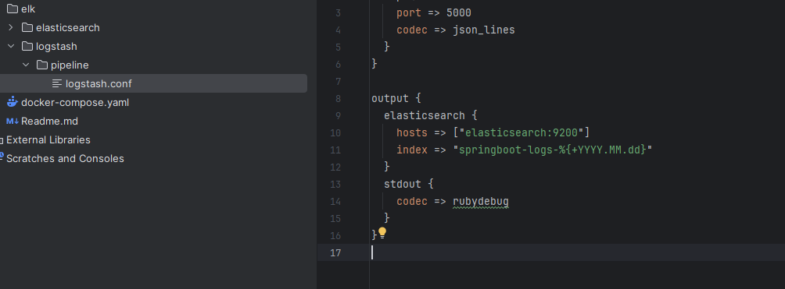
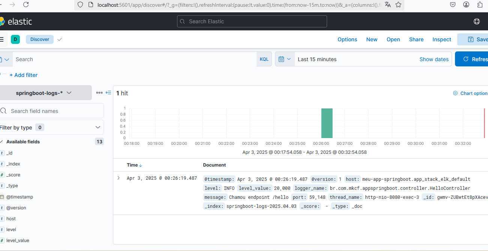

# Projeto de Demonstração da Pilha ELK com Spring Boot

<p align="center"><h6>Support me</h6></p>

<p align="center">
  <a href="https://www.paypal.com/donate/?business=3YHDFH2J8SHEG&no_recurring=0&currency_code=USD"></a>
</p>

Este projeto demonstra o uso prático da pilha ELK (Elasticsearch, Logstash e Kibana) em conjunto com uma aplicação Spring Boot 3.

---

## 🚀 Tecnologias utilizadas

- Docker (versão 20 ou superior)
- Spring Boot 3
- Elasticsearch 7.17
- Logstash 7.17
- Kibana 7.17

---

## 📂 Estrutura do Projeto

O projeto inclui os seguintes componentes:

- **Aplicação Spring Boot**: responsável por gerar logs e enviá-los ao Logstash.
- **Logstash**: recebe logs via TCP, processa-os e os envia ao Elasticsearch.
- **Elasticsearch**: armazena os logs recebidos do Logstash.
- **Kibana**: oferece interface gráfica para visualização e análise dos logs armazenados no Elasticsearch.

---

## ✅ Executando o projeto

### 1. Inicie os containers com Docker Compose

```bash
docker-compose up --build
```

### 2. Teste o endpoint da aplicação Spring Boot

```bash
curl http://localhost:8080/hello
```

Esse comando gera logs que são automaticamente enviados ao Logstash.

---


## 📊 Visualizando os logs no Kibana

Abra o Kibana no seu navegador acessando:

```
http://localhost:5601
```

Para o primeiro acesso, é necessário criar um índice para visualizar os logs.
O nome do indice: pringboot-logs-%{+YYYY.MM.dd}


IU Kibana:

